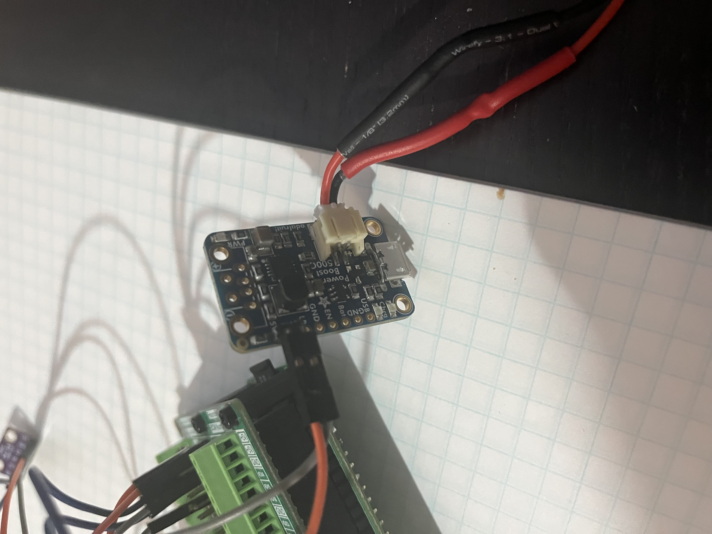

# rocket_telemetry

# Summary

This code supports a Raspberry Pi telemetry system.

Running the telemetry.py with appropriate electronic wiring will output a CSV with the raw data for:

| Column | Description |
| ------ | ----------- |
| time| data point timestamp |
| MET | Mission elapsed time |
| temperature | Ambient temperature |
| pressure | Barometric pressure |
| humidity | Relative humidity |
| acc_x |X axis translation acceleration |
| acc_y | Y axis translation acceleration |
| acc_z | Z axis translation acceleration |
| gyr_x | X axis rotation acceleration |
| gyr_y | Y axis rotation acceleration |
| gyr_z | Z axis rotation acceleration |

The next step is to document this a bit better, calibrate these values into standard units after environment experimentation, and reduce the unit to fit into the Quest Courier rocket that can carry a payload.

1. Document the wiring with photos
1. Solder the electronics onto a single board that fits into the Quest Courier payload bay
1. Some time in the fridge and outside to match temperature value to real temperature (or at least calibrate better)
1. Use real altitude differences of some known structures to calibrate the altitude using pressure value
1. Compare interior home humidity from Ecobee to calibrate humidity
1. Measure the acceleration using the unit attached to my RC car. Not sure yet about rotation.

# Images

## Raspberry Pi in Prototyping Backpack

## Six Axis Accelerometer

## Temperature Sensor

## Power Management Unit

# Some Personal Reminders

## connect over wifi

ssh liam@192.168.1.180
cd rocket_telemetry

## git reminders

* git status
* git commit [-m "message"]
* git push
* git pull
